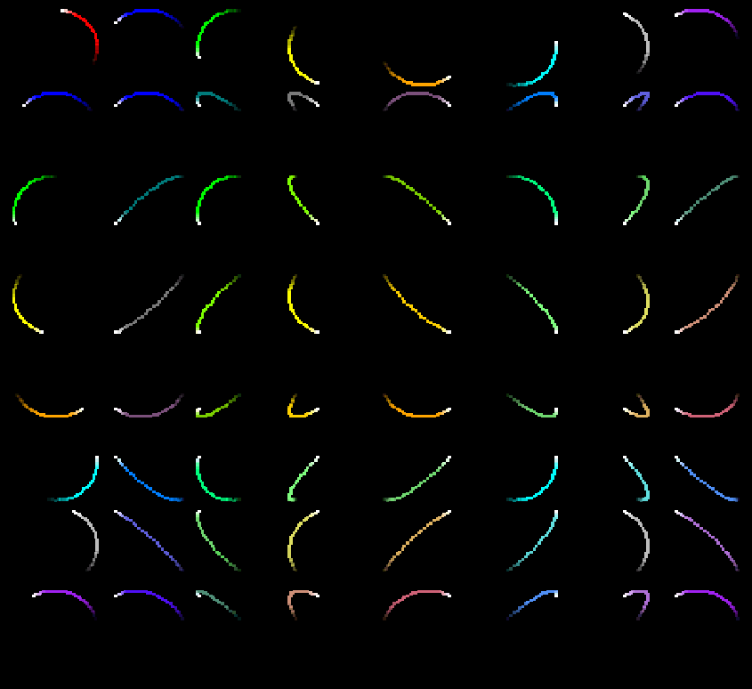
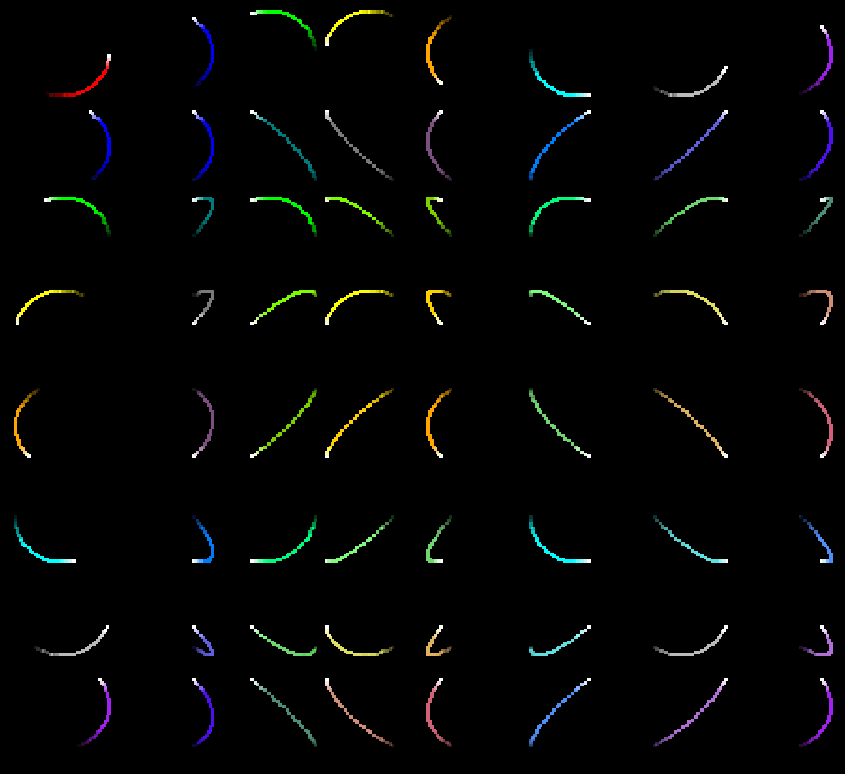

# Circles
Inspired from a page I saw online but have since forgotten, I wanted to replicate what I saw as practice.
There is a row and column of circles, all of uniform diameter and spinning at the same speed.
However, the grid is filled with 'circles' who depend on the X and Y coordinate of their 'header' circles at the row and column.

This leads to a lot of cool patterns, the path of which is drawn and decays as you watch.

In addition, if you hover over a particular circle, it will draw straight horizontal and vertical lines showing all of the 'dependant' shapes.

This was a quick, several hour project and it isn't quite 'perfect' but I'm satisfied with the results. I hope you can enjoy looking at it, learn a thing or two, or be inspired to create your own!
